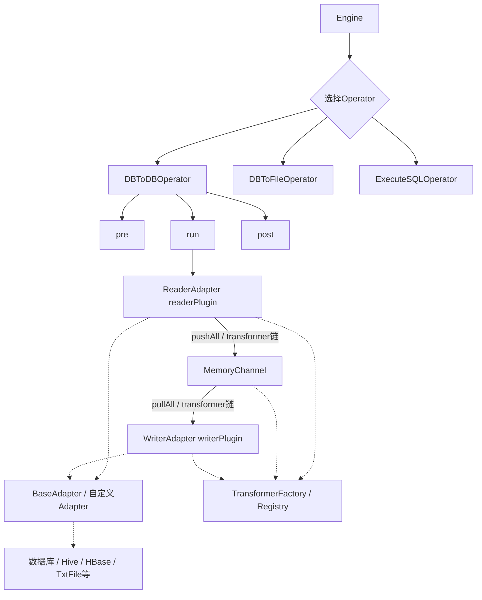
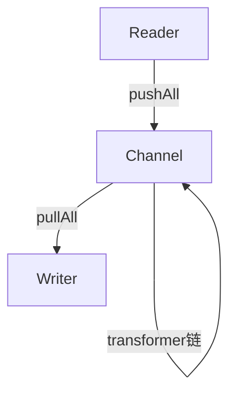

# Java数据同步框架

---

## 文档索引

- [设计记录.md](./doc/设计记录.md)：项目整体设计思路、架构图、核心功能与优化点说明
- [模式与参数说明.md](./doc/模式与参数说明.md)：各模式用途、参数结构、典型配置样本
- [Hive配置模板.md](./doc/Hive配置模板.md)：Hive数据源详细配置模板与参数说明
- [Mysql配置模板.md](./doc/Mysql配置模板.md)：Mysql数据源详细配置模板与参数说明
- [Postgrepsql配置模板.md](./doc/Postgrepsql配置模板.md)：PostgreSQL数据源详细配置模板与参数说明
- [TxtFile配置模板.md](./doc/TxtFile配置模板.md)：TxtFile数据源详细配置模板与参数说明
- [HBase配置模板.md](./doc/HBase配置模板.md)：HBase数据源详细配置模板与参数说明
- [Transformer配置说明.md](./doc/Transformer配置说明.md)：transformer插件链的功能、配置、参数、用法、扩展说明
- 其他文档请查阅 [doc/](./doc/) 目录

---

## 一、项目简介

本项目是一套 数据同步框架，支持多种异构数据源（MySQL、PostgreSQL、Hive、TxtFile等）间的高效、类型安全、插件化数据同步。适用于大规模数据迁移、数据集成、数据落地、批量SQL执行等多种场景。

测试的ui项目地址:https://github.com/ipaipi/paipi_db_web

- **核心理念**：通道解耦、插件化Reader/Writer、类型适配、批量高效、异常可控、分片并发
- **支持数据源**：MySQL、PostgreSQL、Hive、TxtFile、HBase等
- **典型场景**：数据库间同步、数据落地文件、文件入库、批量SQL执行、异构数据源集成

---

## 二、架构与设计思路

### 1. 总体架构

- **主入口**：`Engine` 负责配置加载、模式分发、Operator调度
- **Operator层**：每种模式对应一个Operator（如DBToDBOperator、DBToFileOperator等），统一生命周期（pre、run、post）
- **通用SQL执行模式**：支持单条、多条、批量SQL（文件/分号分隔）、DML/DDL/查询等多种SQL执行，支持结果导出。详见[doc/模式与参数说明.md](./doc/模式与参数说明.md)
- **Adapter层**：每种数据源实现一个Adapter插件（如MysqlAdapter、HiveAdapter、TxtFileAdapter），负责具体的读写逻辑和类型适配
- **通道层**：MemoryChannel实现线程安全的生产者-消费者模型，Reader/Writer解耦
- **报告与上下文**：ReportContext/ReportResponse全链路收集进度、异常、上下文信息

## 架构流程图



### 说明
- **Engine** 负责全局调度，按配置选择合适的 Operator。
- **Operator** 负责一次完整的数据流转生命周期（pre/run/post）。
- **ReaderAdapter/WriterAdapter** 插件化，支持多种数据源和写入目标。
- **Channel**（如MemoryChannel）实现高效缓冲与解耦。
- **Transformer链**支持多种数据转换、过滤、加密等操作。
- **插件体系**高度可扩展，便于自定义Adapter和Transformer。

详细参数和用法请查阅[doc/模式与参数说明.md](./doc/模式与参数说明.md)。

### 2. 设计亮点
- **插件化**：所有数据源均通过Adapter插件实现，Reader/Writer解耦，易于扩展
- **通道解耦**：MemoryChannel支持批量高效传输，防止死锁
- **类型适配**：内置类型转换、批量写入、自动表结构适配，兼容多种数据库
- **分片并发**：支持split方法自动分片，DBToDBOperator支持多分片并发同步
- **异常可控**：全链路异常捕获、上报、日志记录，支持多种表处理策略（报错终止、续传、重命名、覆盖）
- **配置灵活**：支持多种模式（详见《模式与参数说明.md》），参数结构清晰，易于维护

---

## 三、开发规范

### 1. 代码结构与命名
- 包结构分层清晰：Engine、operator、adapter、common、report、config、constant等
- 类名、方法名、变量名采用驼峰命名，接口/抽象类以大写字母开头
- 插件类以Adapter结尾，操作类以Operator结尾
- 常量统一放在constant包下，参数名与配置文件保持一致

### 2. 配置与模式
- 0模式（DB_TO_FILE）为唯一的“拉数落地文件”模式，支持多种文件格式（csv、parquet、json等），参数用common块
- 3、4模式推荐用于所有数据源间同步，参数用reader/writer，TxtFile仅支持4，3和4且无common
- 配置详见《模式与参数说明.md》《各数据源配置模板》

### 3. 注释与文档
- 关键流程、核心方法、易错点必须有中文注释
- 复杂逻辑建议配合时序图、流程图说明
- 重要变更需同步更新文档

### 4. 代码风格
- 统一使用log4j进行日志输出，日志分级清晰
- 变量、方法、类注释齐全，易于维护
- 重要分支、异常、分片、类型适配等需详细注释

---

## 四、异常处理规范

### 1. 全链路异常捕获与上报
- Operator执行（pre、run、post）均有try-catch，异常会被日志记录并写入ReportResponse
- 适配器（BaseAdapter）连接、读写、类型转换等均有重试与详细日志
- 通道写入异常时自动关闭，防止死锁

### 2. 异常上报与追踪
- 任务执行失败时，ReportResponse记录stackTrace、msg、code等详细信息
- 日志采用log4j，支持多级别输出，便于排查
- StringUtils.getErrMsg、removeSensitiveInformation等工具方法用于异常信息脱敏

### 3. 常见异常类型与处理建议
- 配置错误：启动前校验，缺失/错误参数直接抛出异常并终止
- 连接失败：自动重试，重试上限后抛出详细异常
- SQL执行异常：详细日志+异常上报，支持批量SQL回滚
- 类型不匹配：类型适配失败时详细报错，建议提前校验表结构
- 通道阻塞/关闭：写入异常自动关闭通道，Reader感知后优雅退出
- 插件加载失败：Adapter类找不到或实例化失败时，详细日志并终止

---

## 五、插件开发规范

### 1. 插件结构与实现
- 新增数据源需继承BaseAdapter，实现核心方法：
  - getConn、readerPlugin、writerPlugin、split、类型适配等
- 插件类命名规范：xxxAdapter，如MysqlAdapter、HiveAdapter
- 插件需支持split分片、类型转换、批量读写、异常处理
- 支持自定义参数、认证方式（如Hive Kerberos）、HDFS相关、JDBC附加参数等
- HBaseAdapter支持region/range分片，column需指定cf:col格式，详见HBase配置模板

### 2. 插件注册与加载
- 插件通过反射自动加载，类名需与com.paipi.adapter.xxxAdapter保持一致
- 支持缓存Adapter类，提升多任务场景下的加载效率
- 插件扩展点：支持多种表处理策略（报错终止、续传、重命名、覆盖）

### 3. 插件开发注意事项
- 插件需实现split方法，支持分片并发
- 类型适配需兼容目标数据库类型，建议参考BaseAdapter已有实现
- 插件需支持批量读写、异常回滚、进度上报
- 插件参数需与配置模板文档保持一致

---

## 六、项目运行与调试

### 1. 启动方式
- 通过命令行参数指定配置文件路径启动：
  ```
  java -jar xxx.jar <配置文件路径>
  ```
- 支持多种模式，详见《模式与参数说明.md》

### 2. 日志与报告
- 日志、报告、进度、异常均可在指定路径下查看
- 日志分级：INFO/DEBUG/ERROR，便于定位问题
- 任务执行结果、异常、进度等会写入ReportResponse报告文件

### 3. 调试建议
- 推荐先用小数据量测试配置，确认无误后再大规模并发
- 可通过调整channel、batchSize、split等参数优化性能
- 关注通道关闭、异常回滚、类型适配等关键环节

---

## 七、贡献与协作建议

### 1. 代码贡献
- 新增模式、插件、通道、类型适配等需补充详细注释与文档
- 重要变更需同步更新《模式与参数说明.md》《设计记录.md》《各数据源配置模板》
- 建议定期代码review，保持风格统一、注释完善

### 2. 团队协作
- 采用分支开发，合并前需自测并补充文档
- 复杂功能建议先设计评审再开发
- 代码合并需通过review，确保无冗余、无遗留bug

### 3. 新成员快速上手建议
- 先通读《设计记录.md》《模式与参数说明.md》《各数据源配置模板》
- 跟随典型配置样本跑通一条完整链路
- 阅读Engine、BaseOperator、BaseAdapter等核心类源码
- 如有疑问及时查阅注释或向团队成员请教

---

## 八、常见问题与FAQ

1. **如何新增一个数据源？**
   - 继承BaseAdapter，实现核心方法，参考已有Adapter。
   - 补充配置模板、参数说明、测试用例。

2. **如何排查同步失败？**
   - 查看日志和ReportResponse报告，定位异常类型和堆栈。
   - 检查配置参数、表结构、类型适配、通道状态。

3. **如何将表数据导出为文件？**
   - 只需配置 sqlMode=0（DB_TO_FILE），并指定 fileType、isChunk、chunkSize、saveUrl 等参数即可，支持csv、parquet、json等多种格式，详见配置模板和文档。

4. **如何扩展新的文件格式？**
   - 只需实现新的FileWriter和注册到FileWriterFactory，无需修改downloadData和主流程。

5. **如何保证大数据量高效导出？**
   - 合理设置channel、chunkSize参数，利用分块和多线程能力。

---

如需进一步细化某一部分（如插件开发详细流程、异常处理案例、架构图补充等），请随时补充需求！

---

## 九、Transformer 插件链与数据处理

### 1. 功能简介
transformer 是数据同步链路中的“数据处理插件”，用于在 Reader 读取数据后、Writer 写入前，对每条 Record 进行灵活的数据清洗、转换、脱敏、加密等操作。其设计完全兼容 DataX 风格，支持链式调用、参数化配置、内置与自定义扩展。

### 2. 架构原理
- 执行链路：Reader → Channel（自动执行transformer链）→ Writer
- 注入方式：在 job.content.common.parameter 或 job.content.reader.parameter 中配置 transformer 数组，系统自动解析并注入到 Channel。
- 执行时机：每条 Record 在 push 到 Channel 时，依次经过 transformer 链处理。

#### 架构图


### 3. 配置格式
```json
"transformer": [
  { "name": "trim", "parameter": { "columnIndex": [1, 7] } },
  { "name": "replace", "parameter": { "columnIndex": [7], "oldValue": "简介", "newValue": "自我介绍" } },
  { "name": "filter", "parameter": { "columnIndex": [2], "value": "18", "op": ">" } },
  { "name": "dateformat", "parameter": { "columnIndex": [6], "fromFormat": "yyyy-MM-dd HH:mm:ss", "toFormat": "yyyyMMddHH" } },
  { "name": "md5encrypt", "parameter": { "columnIndex": [1] } }
]
```

### 4. 支持的内置 transformer 及参数
| name         | 作用           | 主要参数（parameter）         | 说明/示例 |
|--------------|----------------|------------------------------|-----------|
| trim         | 去除首尾空格   | columnIndex                  |           |
| replace      | 字符串替换     | columnIndex, oldValue, newValue |         |
| filter       | 过滤记录       | columnIndex, value, op(=,!=,>,<) | 只判断第一个字段 |
| dateformat   | 日期格式转换   | columnIndex, fromFormat, toFormat | 支持String/DateColumn |
| md5encrypt   | MD5加密        | columnIndex                  |           |

### 5. 典型场景与注意事项
- 支持多 transformer 串联，顺序影响结果。
- 字段类型需为 StringColumn/DateColumn，非目标类型自动跳过。
- 参数缺失、索引越界、类型不符时自动跳过并输出日志，不影响主流程。
- filter 只判断 columnIndexSet 的第一个字段，避免多字段误过滤。
- dateformat 支持字符串和日期类型，格式不符时有详细日志。

### 6. 扩展与自定义
- 支持自定义 transformer，注册到 TransformerRegistry 即可。
- 详见 com.paipi.transformer.impl 包和 transformer 注册机制。

---

## writeMode多模式写入能力

- 框架支持DataX风格的writeMode参数，控制数据库写入时主键/唯一键冲突的处理方式。
- 支持insert/replace/update/ignore四种模式，详见《模式与参数说明.md》。
- 典型配置：
  ```json
  {
    "writer": {
      "name": "Mysql",
      "parameter": {
        "table": "user",
        "column": ["id", "name"],
        "writeMode": "update"
      }
    }
  }
  ```
- 不同数据库支持情况、详细语义和注意事项请查阅[doc/模式与参数说明.md](./doc/模式与参数说明.md)。

### 通用SQL批量执行模式

- 用途：支持单条、多条、批量SQL（文件/分号分隔）、DML/DDL/查询等多种SQL顺序执行，支持最后一条查询结果导出。
- 参数结构：
  - job.content[].common（必需，含connection、sql或sqlFile、可选saveUrl、fileType、isChunk、chunkSize、sep等）
- 样本：
```json
{
  "job": {
    "setting": {
      "speed": { "channel": 1 },
      "reportPath": "C:/pro/paipi_db/local_test/temp/report_file.json",
      "enablePreCheck": true,
      "enablePostCheck": true
    },
    "sqlMode": 1,
    "content": [{
      "common": {
        "name": "Mysql",
        "parameter": {
          "connection": { "ip": "192.168.232.100", "port": "3306", "username": "root", "password": "admin", "database": "demo" },
          "sql": "update user set name='张三' where id=1;delete from user where id=2;select * from user;",
          "sqlFile": "./batch.sql",
          "saveUrl": "C:/pro/paipi_db/local_test/temp/result.csv",
          "fileType": "csv",
          "isChunk": true,
          "chunkSize": 2000000,
          "sep": ","
        }
      }
    }]
  }
}
```
- 主要参数说明：
  | 参数名      | 说明                         |
  |-------------|------------------------------|
  | fileType    | 导出文件类型（csv/parquet/json等）|
  | isChunk     | 是否分块导出（true/false）   |
  | chunkSize   | 每个数据文件最大行数         |
  | sep         | 字段分隔符（csv专用）        |
  | saveUrl     | 导出文件保存路径             |

- 行为说明：
  - 所有SQL顺序执行，只有最后一条SQL如有saveUrl时才尝试导出结果。
  - 最后一条SQL会先执行校验，只有有结果集（如SELECT/CTE/存储过程等）时才会调用downloadData高效导出，否则仅记录日志不导出。
  - 导出时优先使用fileType、isChunk、chunkSize、sep等参数，支持csv/json/parquet等多种格式，分块/单文件均可。
  - 其它SQL（包括中间的SELECT）只执行不导出结果。
  - 兼容所有批量/单条/文件/分号分隔等场景。

- 注意事项：
  - fileType 支持 csv、parquet、json 等，未来可扩展。
  - isChunk=true 时，导出为分块目录，每个目录下有多个数据文件和 indexMap.json。
  - isChunk=false 时，导出为单层目录，多个数据文件。
  - chunkSize 控制每个数据文件最大行数。
  - 目录结构、indexMap.json、文件命名等详见实现和样例。
  - 其他参数与原有模式一致，详见各数据源配置模板。