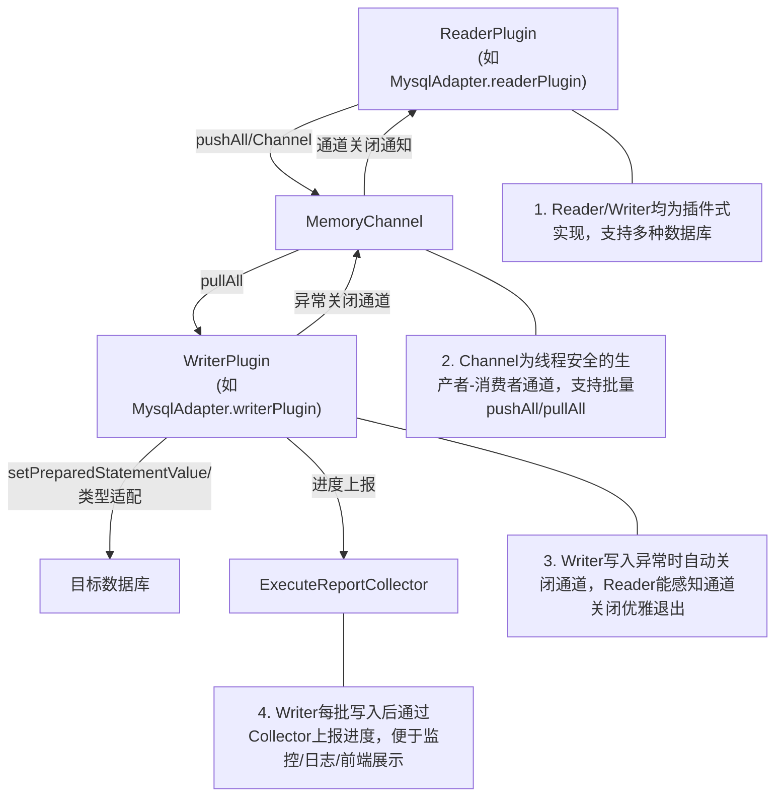

# paipidb数据同步框架（Java实现）

## 一、项目简介
本项目实现了数据同步框架，支持异构数据库间高效、类型安全、插件式的数据同步。核心思想为"通道解耦、插件式Reader/Writer、类型适配、批量高效、异常可控"，适合大规模数据迁移、同步、集成等场景。
目前项目支持多种模式（src/main/java/com/paipi/enums/SqlMode.java），其中0模式为“拉数将表的数据落成文件”，2模式是数据库间同步，1模式为SQL执行。
模式 0 是用来拉数据落成csv、parquet、json等文件，支持分块/单文件，参数详见fileType、isChunk、chunkSize等，程序的人口是src/main/java/com/paipi/Engine.java

---

## 二、核心架构

### 架构图

### 文字说明
- 插件式Reader/Writer：所有数据库适配器均实现readerPlugin/writerPlugin，支持多种数据源。
- 通道解耦：MemoryChannel为线程安全的生产者-消费者通道，支持批量pushAll/pullAll。
- 类型适配/批量能力：Writer端类型安全、自动截断，批量写入高效。
- 进度统计/异常处理：Writer每批写入后通过Collector上报进度，写入异常时自动关闭通道，Reader能感知通道关闭优雅退出。

---

## 三、主要功能与优化点 

---

## 四、分片并发与类型适配架构改造说明

### 1. 分片并发
- **分片能力（split）**：所有 Adapter（如 MysqlAdapter、HiveAdapter、TxtFileAdapter）均实现 split 方法，支持按主键、分区、HDFS Block、文件行数等多种方式自动切分任务，提升并发与吞吐。
- **分片调度**：DBToDBOperator 支持多分片并发，每个分片独立 reader/writer/channel，主流程自动汇总统计，兼容单分片与多分片。

### 2. Writer并发安全与分片输出
- **TxtFileAdapter.writerPlugin**：每个分片自动写独立文件，文件名自动拼接 splitId，彻底避免并发写同一文件导致的数据错乱。
- **输出文件名智能推断**：自动根据原 filePath 推断输出目录和基础文件名，分片文件名规范统一。

### 4. Hive高效批量写入与类型适配
- **自动获取表结构与类型**：HiveAdapter.writerPlugin 利用 getTableColumns 获取字段名及类型，类型统一转换为内部类型。

---

## transformer插件架构设计与实现

### 1. 架构原理
- transformer链在Channel层自动执行，Reader/Writer/Adapter/Operator均无需关心。
- 支持注册表+工厂模式，内置与自定义transformer均可灵活扩展。
- 每个transformer实现Transformer接口，支持参数化构造和链式调用。

### 2. 设计亮点
- 插件化、解耦、易扩展。
- 健壮性高，异常不影响主流程。
- 支持多种常见数据处理场景（清洗、脱敏、加密、过滤、格式转换等）。

### 3. 变更记录
- 2024-06-xx：引入transformer插件机制，支持trim、replace、filter、dateformat、md5encrypt等内置transformer，支持链式配置和自定义扩展。
- 2024-06-xx：优化filter、dateformat等transformer的健壮性和日志输出。

---
